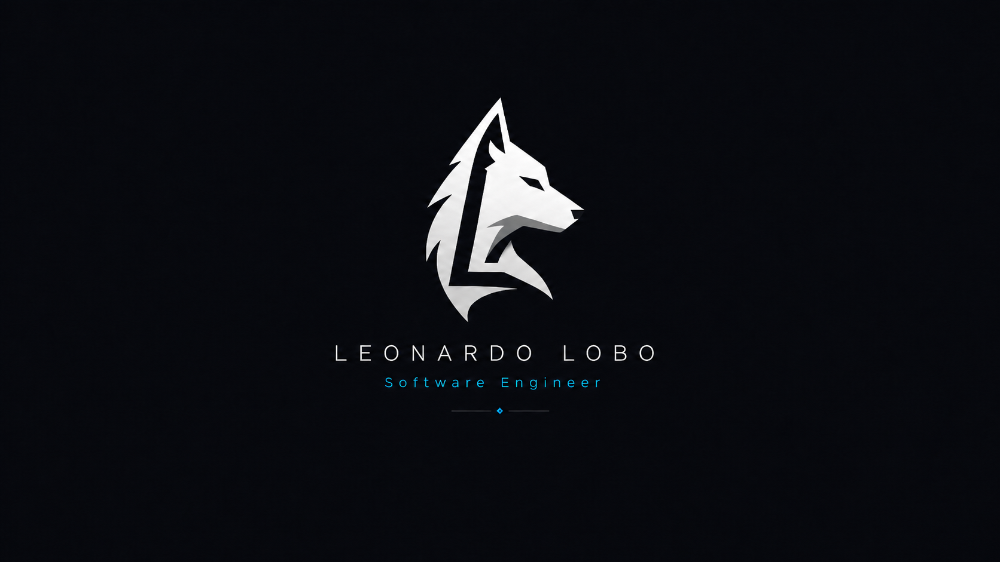

<p align="center">
  
</p>

# Hi, I'm Leonardo Lobo 🐺

> **Software Engineer** building reliable, scalable software.

I'm passionate about designing scalable systems, solving complex engineering problems, and building high-quality software.

Currently, I'm focused on exploring:

- 🤖 AI Agents
- 🏗️ System Design
- 🌐 Distributed Systems
- 📱 Android Development
- ⚡ Performance Engineering
- 🐺 Open Source

> **Always building. Always learning.**

---

## 🛠️ Tech Stack

<p align="left">
  
  
  
  
  
  
  
  
</p>

---

## 🚀 Current Focus

```text
✓ AI Agents
✓ System Design
✓ Distributed Systems
✓ Android
✓ Open Source
✓ Software Architecture
```

---

## 🌎 Connect with me

<p align="left">
  <a href="mailto:leonardogomeslobo@gmail.com">
    
  </a>

  <a href="https://www.linkedin.com/in/leonardo-lobo-166317182/">
    
  </a>
</p>

---

<p align="center">
  <i>"The strength of the wolf is the pack, and the strength of the pack is the wolf."</i>
</p>
